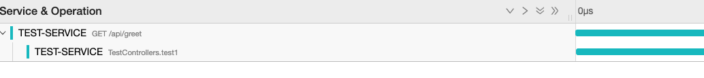
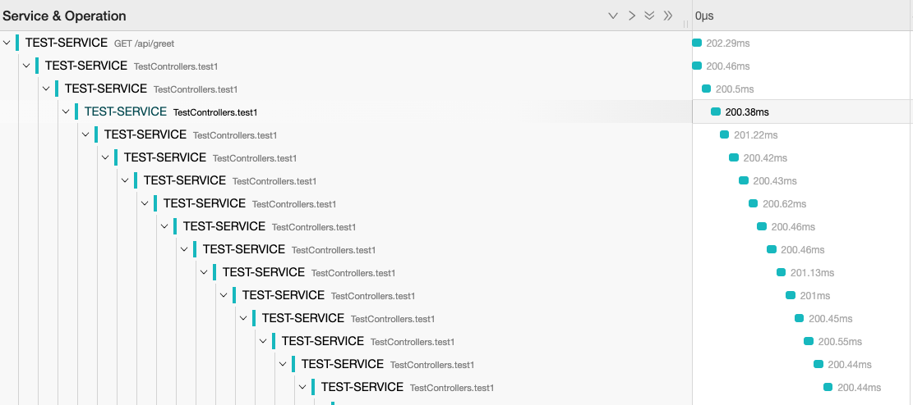

# Loop-trace-debug-app
This Sample Spring Boot application is to reproduce trace stitching to wrong context and create loop like traces.


### What is an Issue?
- On high load, Traces generated started stitching wrongly.

### How to Reproduce ?
- Here, Start application with Java Agent
- Use some performance testing tool to generate high load.
  - Jmeter - 20 threads, 200 Throughput 
  - Test API : http://localhost:9999/api/greet?name=SomeName&delay=100

### Resulting Error: 





## Other findings
1. Only happens after java-agent version - 1.6.2
2. It is not happening when 
   1. suppress strategy to none
       ```
          -Dotel.instrumentation.experimental.span-suppression-strategy=none
       ```
   2. or remove executor instrumentation
       ```
          otel.instrumentation.executor.enabled=false
       ```

    
### How to build:
```
mvn clean install package
```

### How to Start :
```
    java -javaagent:opentelemetry-javaagent-all.jar 
         -Dotel.javaagent.configuration-file=opentelemetry-javaagent.properties 
         -Dotel.traces.exporter=jaeger 
         -Dotel.exporter.jaeger.endpoint=http://<collector>:14250 
         -Dotel.resource.attributes=service.name=TEST-SERVICE
         -Dotel.propagators=tracecontext,baggage,jaeger
         -Dotel.metrics.exporter=none
         -Dotel.logs.exporter=none 
         -jar target/test-service-1.0.0-SNAPSHOT.jar
```
